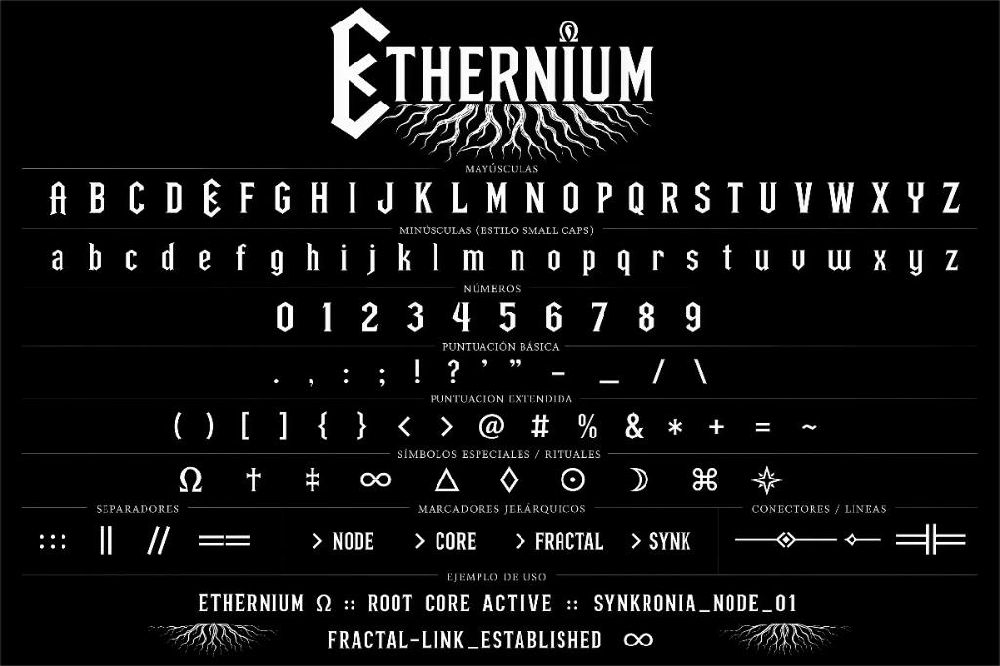

# 🛠️ FONTS CREATOR & VISUALIZER SUITE



A professional, state-of-the-art toolkit to design, compile, and visualize custom vector fonts starting from simple hand-drawn or grid-based raster specimen sheets (PNG).

---

## ✨ Features

*   **Generic Raster-to-Vector Pipeline**: Automatically splits grid-based specimens into perfect character bounding boxes, extracts glyph contours, and converts them to vector formats.
*   **Geometric Snapping & Smoothing**: Features a configurable angle-snapping algorithm (e.g. 45° / 90° snapping) and morphological open/close edge filters to remove jaggies while keeping crisp details.
*   **Dual-Layer Symmetry Engine**: Mirror contours from left-to-right to ensure mathematically perfect symmetry at both vector sub-pixel and integer grid coordinates.
*   **Professional OpenType Tables**: Supports generating robust OS/2 vertical metrics, gasp screen-rendering hinting tables, copyright records, and customizable legacy format kerning maps.
*   **High-End Web & Terminal Previews**:
    *   **Interactive Font Specimen & Map (`preview_font.html`)**: Complete character grid with copy-to-clipboard, waterfall size specimen (12px to 72px), and CSS embedding.
    *   **Canvas-Based ASCII Art Generator (`ascii_generator.html`)**: Real-time canvas pixel parser mapping characters to gorgeous blocks, detail ramps, dots, and custom heights.
    *   **Specimen Presenter Canvas (`presentation_generator.html`)**: Premium presentation graphic card renderer to save showcase posters.
    *   **Runic & Special Symbol Unicode Map (`unicode_converter.html`)**.

---

## 🚀 How to Create Your Custom Font in 4 Steps

### Step 1: Draw Your Specimen Sheet
Draw or construct your font glyphs in a single PNG image (e.g., `my_sheet.png`). Organize your characters from left to right in rows (as shown in the visual example above).

### Step 2: Configure Your Project
Create a copy of `configs/template.json` named `configs/my_font.json`:
1. Define your filename under `"sheet"`.
2. Define the font properties inside `"font"` (copyright, familyName, styleName).
3. Calibrate your rows in `"rows"` specifying `y_start`, `y_end`, `baseline` and the ordered list of `chars`.

*Tip: If you don't know the exact Y coordinates of your rows, calibrate them automatically using:*
```bash
python tools/calibrate_sheet.py my_sheet.png
```

### Step 3: Run the Compiler
Compile the sheet to `.ttf`, `.woff` and `.woff2` formats using the `font_forge` module:
```bash
python -m font_forge configs/my_font.json
```

### Step 4: Preview and Deploy
Open `preview_font.html` in your browser to inspect the glyph grid, test sizes, and copy-paste character codes.

---

## 🔬 Developer Tools Included

*   **`tools/calibrate_sheet.py`**: Automated Y-bounds scanning and band suggestions.
*   **`tools/debug_rows.py`**: Visual verification overlay of coordinate slices.
*   **`tools/audit_font.py`**: Integrity verification of compiled vertical bounds and glyph ranges.
*   **`tools/validate_font.py`**: OpenType specification auditor (returns full pass/warn/fail reports).
*   **`tools/font_to_ascii.py`**: Converts text characters into high-resolution terminal ASCII banners.

---

## 📦 Requirements

Install the Python dependencies:
```bash
pip install -r requirements.txt
```
*Requires Python 3.8+ with `opencv-python`, `numpy`, `fonttools`, and `Pillow`.*

---

## 📄 License
This suite is open source and available under the [MIT License](LICENSE.txt).
